<h1>
    Makhambet Aidynuly IT-2504 
    Assignment #3
</h1>

<h1>GitHub Pages Link: <strong>https://aidynulymakhambet.github.io/Assignment--3-WEB/</strong></h1>

<h2>Task #0</h2>
<h3>Task decription</h3>
<h4>
    Task 0. Responsive Typography 
    <ul>
        <li>Create a simple webpage with headings and paragraphs.</li>
        <li>Use media queries to change font sizes for mobile, tablet, and desktop.</li>
    </ul>
    Example: small font on mobile, medium on tablet, larger on desktop.
</h4>

<h4>Screenshots:</h4>

<table>
  <tr>
    <td>
      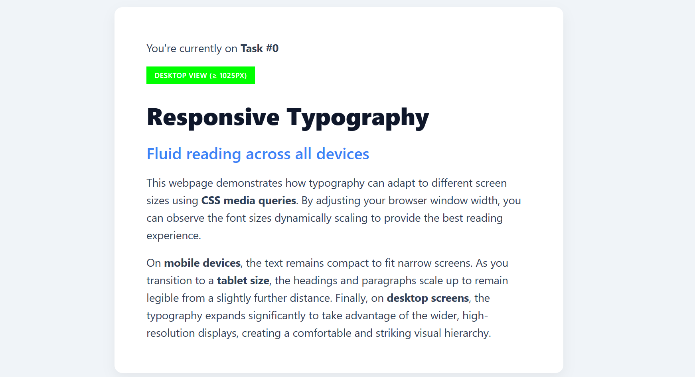 
      <b>When viewed on Desktop</b> 
      Smaller font and bigger gaps.
    </td>
  </tr>
</table>

 

<table>
  <tr>
    <td>
      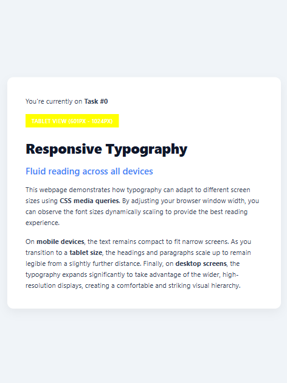 
      <b>When viewed on Tablet</b> 
      Medium font and Medium gaps
    </td>
  </tr>
</table>

 

<table>
  <tr>
    <td>
      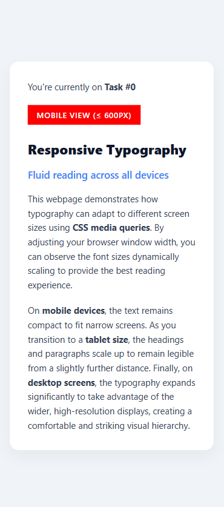 
      <b>When viewed on Mobile</b> 
      Bigger font and Smaller gaps
    </td>
  </tr>
</table>

Code for Task #0 can be found <a href="Task_0.html">Here</a>.

 

<h2>Task #1</h2>
<h3>Task decription</h3>
<h4>
    Task 1. Responsive Layout with Media Queries 
    <ul>
        <li>Create a webpage with three boxes in a row.>
        <li>On desktop: display all three side by side.</li>
        <li>On tablet: display two boxes in a row.</li>
        <li>On mobile: display boxes stacked vertically.</li>
        <li>Use only CSS media queries (no Bootstrap).</li>
    </ul>

</h4>

<h4>Screenshots:</h4>

<table>
  <tr>
    <td>
      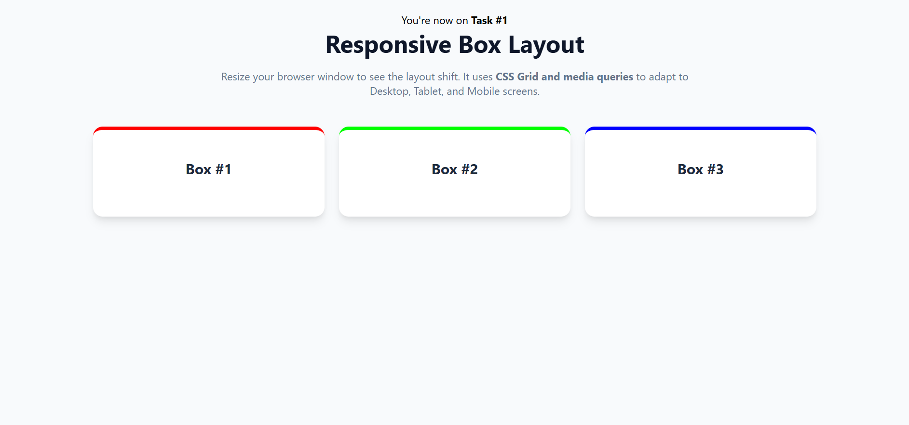 
      <b>When viewed on Desktop</b> 
      All 3 box lined up on one row.
    </td>
  </tr>
</table>

 

<table>
  <tr>
    <td>
      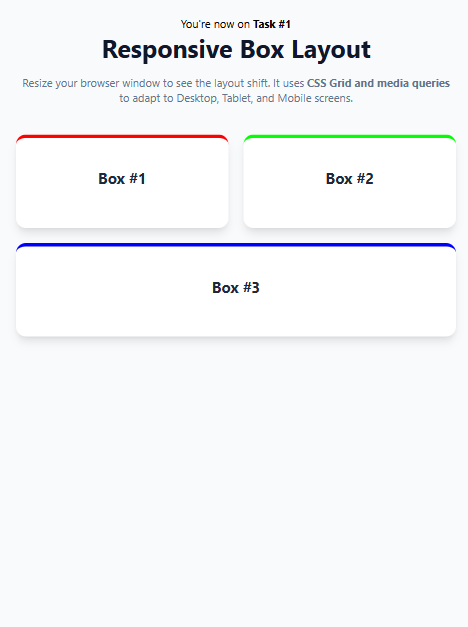 
      <b>When viewed on Tablet</b> 
      On tablets: grid with first 2 boxes on top and second line entirely taken by third box
    </td>
  </tr>
</table>

 

<table>
  <tr>
    <td>
      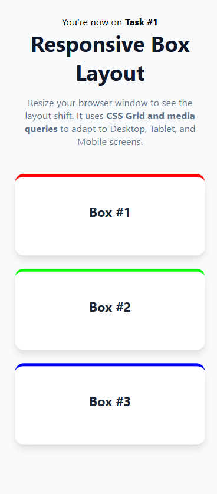 
      <b>When viewed on Mobile</b> 
      All 3 boxes lined up vertically.
    </td>
  </tr>
</table>

Code for Task #1 can be found <a href="Task_1.html">Here</a>.

 

<h2>Task #2</h2>
<h3>Task decription</h3>
<h4>
    Task 2. Bootstrap Responsive Columns
    <ul>
        <li>Build a responsive layout using Bootstrap’s 12-column grid.</li>
        <li>
            Create three columns:
            <ul>
                <li>On desktop: each column takes 4 columns (3 equal parts).</li>
                <li>On tablet: two columns on the first row and one on the second row.</li>
                <li>On mobile: all columns stacked.</li>
            </ul>
        </li>
    </ul>
</h4>

<h4>Screenshots:</h4>

<table>
  <tr>
    <td>
      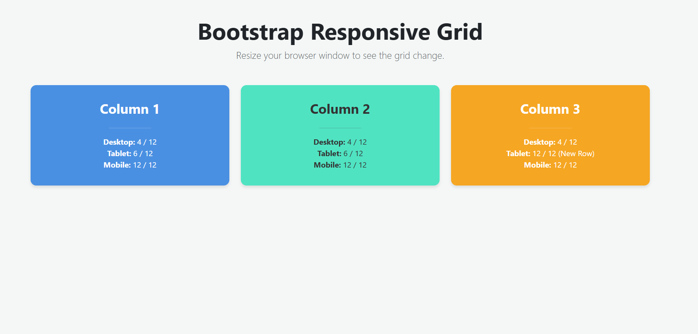 
      <b>When viewed on Desktop</b> 
      All 3 box lined up on one row. But with bootstrap
    </td>
  </tr>
</table>

 

<table>
  <tr>
    <td>
      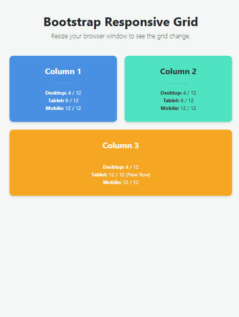 
      <b>When viewed on Tablet</b> 
      On tablets: grid with first 2 boxes on top and second line entirely taken by third box. But with bootstrap
    </td>
  </tr>
</table>

 

<table>
  <tr>
    <td>
      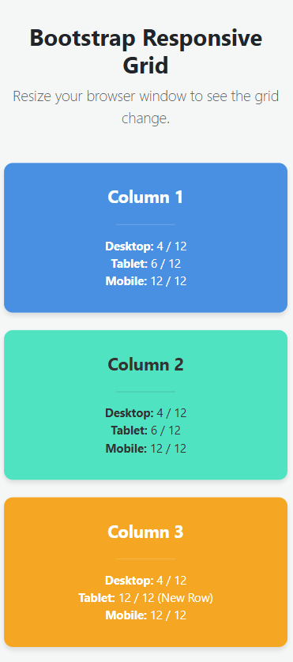 
      <b>When viewed on Mobile</b> 
      All 3 boxes lined up vertically. But with bootstrap
    </td>
  </tr>
</table>

Code for Task #2 can be found <a href="Task_2.html">Here</a>.

 

<h2>Task #3</h2>
<h3>Task decription</h3>
<h4>
    Task 3. Bootstrap Navigation Bar
    <ul>
        <li>Create a responsive navigation bar using Bootstrap components.</li>
        <li>It should include: a logo on the left, links on the right, and collapse into a hamburger menu on smaller screens.</li>
    </ul>
</h4>

<h4>Screenshots:</h4>

<table>
  <tr>
    <td>
      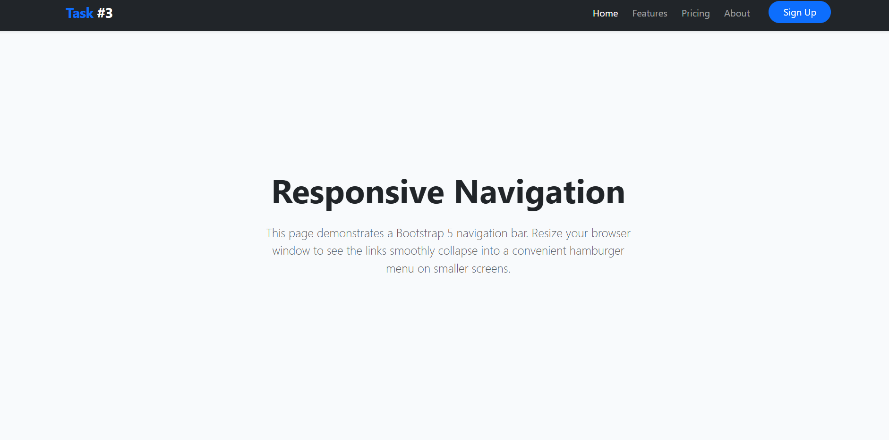 
      <b>When viewed on Desktop</b> 
      On Desktop menu on the right visible without dropdwon menu
    </td>
  </tr>
</table>

 

<table>
  <tr>
    <td>
      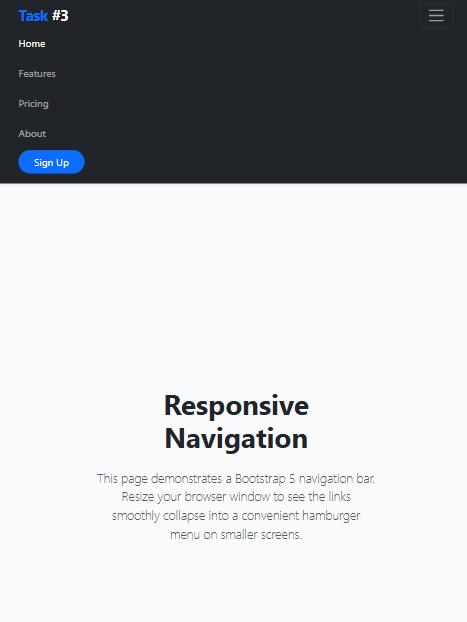 
      <b>When viewed on Tablet</b> 
      On tablets: menu on the right have a button for a dropdown menu.
    </td>
  </tr>
</table>

 

<table>
  <tr>
    <td>
      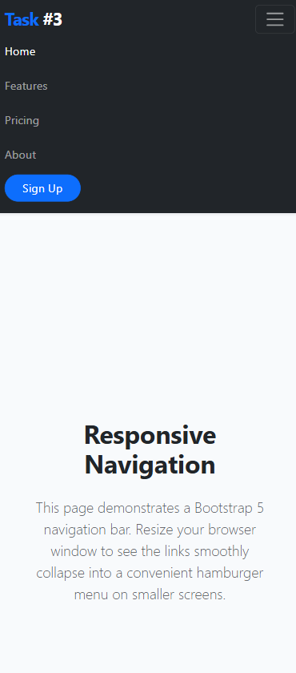 
      <b>When viewed on Mobile</b> 
      On mobile: also a button for with a dropdown menu
    </td>
  </tr>
</table>

Code for Task #3 can be found <a href="Task_3.html">Here</a>.

 

<h2>Task #4</h2>
<h3>Task decription</h3>
<h4>
    Task 4. Responsive Portfolio Page
    <ul>
        <li>Create a portfolio page using both Media Queries and Bootstrap Grid.</li>
        <li>
            Requirements:
            <ol>
                <li>Header with a Bootstrap navbar.</li>
                <li>
                    Main section divided into two parts:
                    <ul>
                        <li>Left side: portfolio projects (use Bootstrap grid to arrange cards).</li>
                        <li>Right side: sidebar with personal info and contact details.</li>
                    </ul>
                </li>
                <li>Footer across the bottom.</li>
            </ol>
        </li>
        <li>Apply custom media queries to adjust font sizes, spacing, and element visibility for mobile, tablet, and desktop.</li>
        <li>Ensure that the page looks clean and usable across different screen sizes.</li>
    </ul>
</h4>

<h4>Screenshots:</h4>

<table>
  <tr>
    <td>
      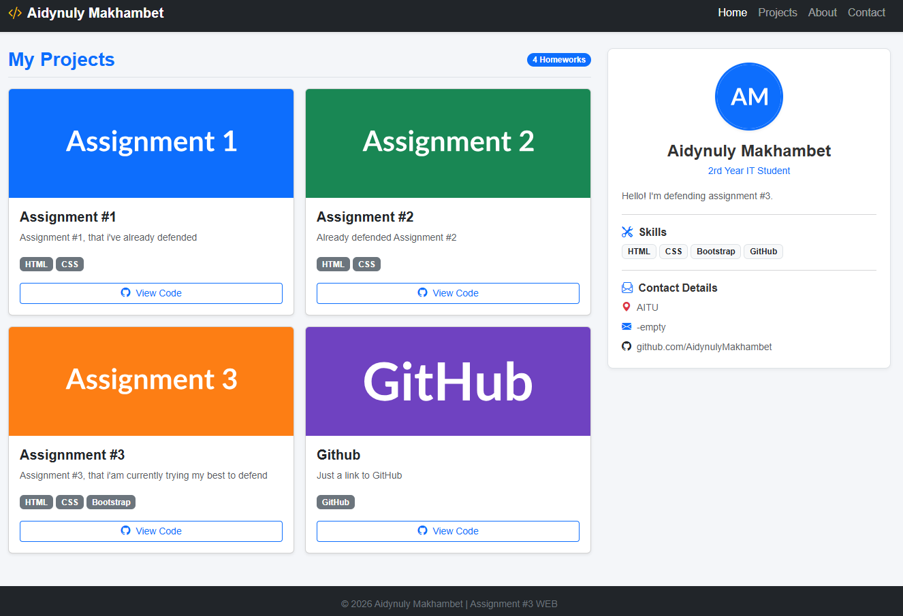 
      <b>When viewed on Desktop</b> 
      On Desktop everything is visible on one screen
    </td>
  </tr>
</table>

 

<table>
  <tr>
    <td>
      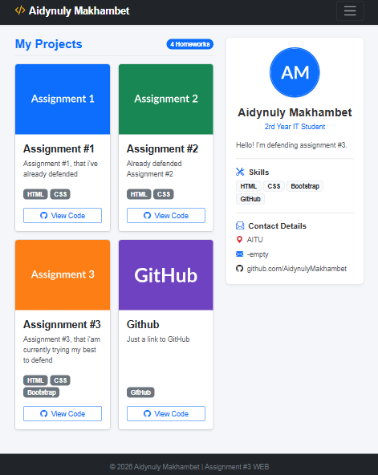 
      <b>When viewed on Tablet</b> 
      On tablets: everyting can be seen one one screen except top-right menu, it hides in dropdown menu, which can be accessed with a button.
    </td>
  </tr>
</table>

 

<table>
  <tr>
    <td>
      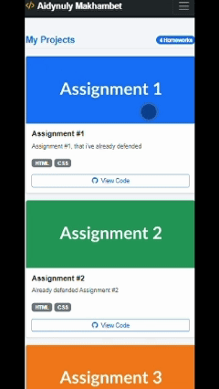 
      <b>When viewed on Mobile</b> 
      On mobile: Everything is lined up, page becomes longer, top-right menu hides behind a button in dropdown menu
    </td>
  </tr>
</table>

Code for Task #4 can be found <a href="Task_4.html">Here</a>.